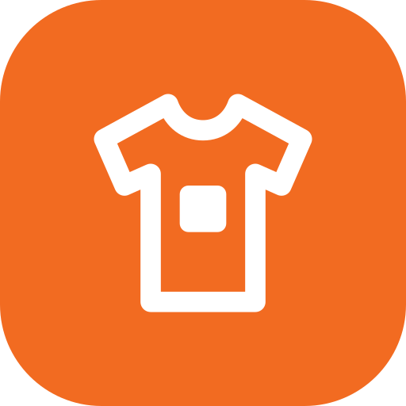
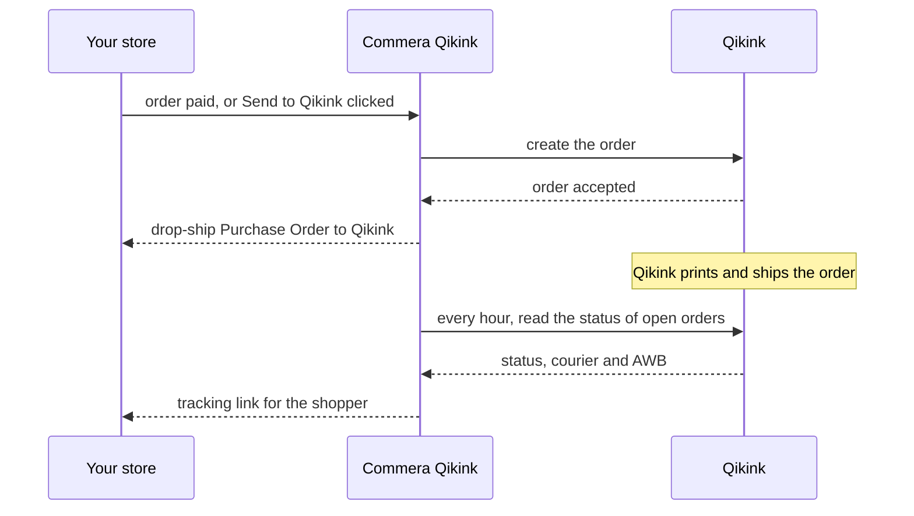
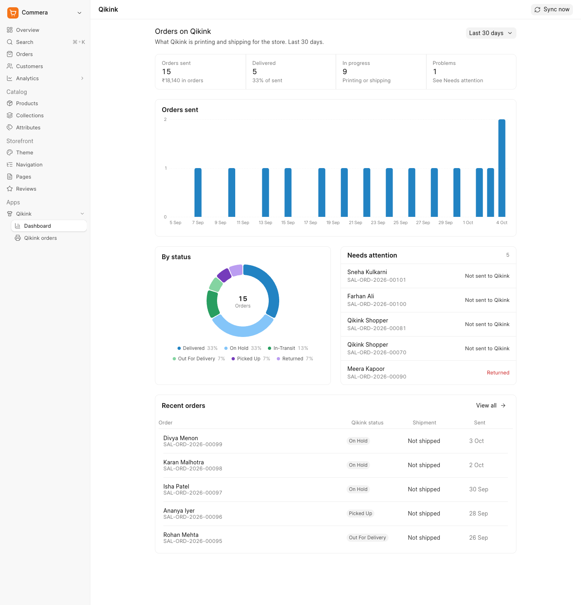
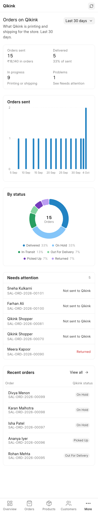

<div align="center" markdown="1">


<h1>Commera Qikink</h1>

<a href="https://buildwithhussain.com"></a>

**Send Commera orders to Qikink for print on demand**

<p>
	
</p>

</div>

Commera Qikink lets a Commera store sell print-on-demand products: Qikink prints and ships each order, and
ERPNext buys it from Qikink with a drop-ship Purchase Order. Read the **[setup guide](https://docs.bwh.tech/qikink)**.

### Print partner

- **Qikink**: prints each order and ships it to the shopper, with a sandbox for testing

### Features

- Paid orders go to Qikink by themselves; cash on delivery orders go with **Send to Qikink**
- A drop-ship Purchase Order to Qikink for each order Qikink accepts
- One Qikink SKU per product variant, for your own designs or for blank catalog products
- Courier, AWB and tracking link on the order once Qikink ships, checked every hour
- Checkout refuses a cart with a Qikink product that has no Qikink SKU
- An order is never sent twice, even when a send fails halfway
- A dashboard and an orders page for everything sent to Qikink

### How it works



### Dashboard

Click **Apps > Qikink** in the Commera sidebar. For the period you pick, it shows how many orders went to
Qikink and where they are, orders sent per day, orders by Qikink status, the orders that need you, and the
five newest orders. **Sync now** reads the status of every open order from Qikink.

<picture>
  <source media="(prefers-color-scheme: dark)" srcset="docs/images/dashboard-dark.png">
  
</picture>



### Limits

- Qikink has no cancel API. Cancel the order on Qikink's dashboard, click **Mark cancelled on Qikink** on
  the order, then cancel it.
- Qikink has no webhooks, so a new status arrives within an hour, or when you click **Refresh Qikink status**.
- The status sync looks through your newest 200 Qikink orders.
- Paying Qikink from your wallet, and the Purchase Invoice for it, are manual.

### Installation

You need Commera, on ERPNext and Frappe 16 or later.

```bash
bench get-app https://github.com/Rl0007/commera_qikink
bench --site your.site install-app commera_qikink
bench build --app commera_qikink
```

Then follow the [setup guide](https://docs.bwh.tech/qikink) to connect your Qikink account and map your
products to Qikink SKUs.

### Adding a Commera app of your own

This app is the worked example in Commera's developer docs. The
[step-by-step guide](https://docs.bwh.tech/commera/build-an-app/overview) builds it from an empty app:
settings, product mapping, the checkout and order hooks, drop-ship orders, status sync, and the dashboard
pages, cards and actions under `commera/`, tests included.

### Development

```bash
bench --site test_site set-config allow_tests true
# once: send one order to Qikink and map one item to a Qikink SKU on the site
bench --site test_site run-tests --app commera_qikink
```

The tests use the real database and never call Qikink. `yarn dev` rebuilds the dashboard extensions under
`commera/` each time you save.

### Support

Found a bug or have a question? [Open an issue](https://github.com/Rl0007/commera_qikink/issues).

## About BWH Tech

Commera Qikink is developed and maintained by [BWH Tech](https://bwh.tech), a tech company based in Jagdalpur,
Chhattisgarh, specializing in Frappe customizations and consulting.

#### License

MIT
